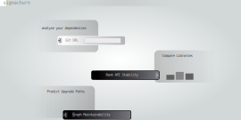

# signachurn
- analyse API changes over release history
- compare libraries on API stability
- quantify future/past wasted time on 'reworks'
- quantify future affect on ecosystem based on known dependants

## problem
reworking is usually bad for dependants: you retype something, all dependants must adjust their code

## auxiliary
signachurn identifies signature changes over release history

- devs encouraged to pick dependencies that will require less rework
- dependencies encouraged design with the future in mind, adapt method bodies rather than method names/types

## under-the-hood
signachurn is a tool built using golang made of several components

- a database (pocketbase)
  - store signature scan data
  - store known dependants statistics
- a web frontend
  - developer / project manager interface
- a job system
  - keeps up-to-date with libs
- a job scan plugin system
  - for adding language support

